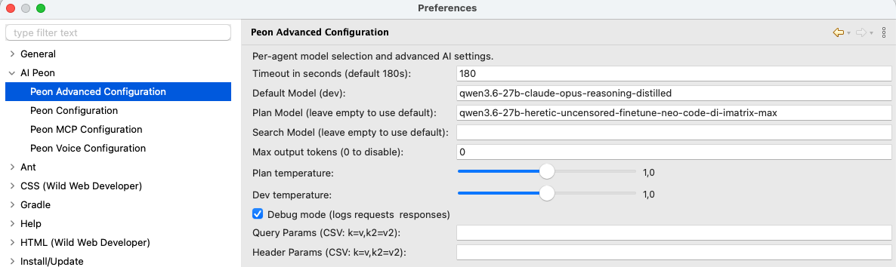

# Advanced Configuration

The AI Peon plugin provides advanced configuration options accessible via **Window > Preferences > Peon AI > AI Peon Advanced**.



## Per-Agent Model Selection

Different agents can use different models to optimize for cost, speed, or capability:

| Agent | Purpose | Recommended Model Type |
|-------|---------|----------------------|
| **Search** | Finding relevant context and information | Fast, smaller models (e.g., `gpt-4o-mini`, `llama3.2`) |
| **Plan** | Creating task plans and strategies | Reasoning-capable models (e.g., `o3-mini`, `gemini-2.0-flash`) |
| **Dev** | Code generation and implementation | Strong coding models (e.g., `gpt-4o`, `claude-sonnet`) |

### How It Works

1. Leave a field empty to use the default model for that agent
2. Enter a specific model name to override only that agent's model
3. Models are validated against your provider's available models when you click "Check Host and Port..."

**Example Setup:**
- Default Model: `gpt-4o`
- Search Model: `gpt-4o-mini` (faster, cheaper for search)
- Plan Model: *(empty - uses default)*
- Dev Model: `claude-sonnet` (stronger coding capability)

## Temperature Settings

Temperature controls the randomness of model outputs:

| Setting | Range | Effect |
|---------|-------|--------|
| **Plan Temperature** | 0.0 - 2.0 | Higher = more creative plans; Lower = more deterministic |
| **Dev Temperature** | 0.0 - 2.0 | Higher = more varied code; Lower = more consistent output |

### Recommended Values

- **Planning**: 0.3-0.7 (balance creativity with reliability)
- **Development**: 0.1-0.3 (consistency is important for code)

## Debug Mode

When enabled, logs all requests and responses to the Eclipse console:

```java
// Example log output when debug mode is enabled
[DEBUG] Request: {"model": "gpt-4o", "messages": [...], "temperature": 0.2}
[DEBUG] Response: {"choices": [{"message": {...}}], "usage": {...}}
```

**Use cases:**
- Troubleshooting connection issues
- Understanding what context is being sent to the model
- Debugging prompt template issues

## Query Parameters

Add custom query parameters to API requests (format: `key=value,key2=value2`):

**Example:** `stream=false,timeout=30`

Useful for:
- Provider-specific options not exposed in the UI
- Testing different API behaviors
- Adding custom headers through query strings

## Header Parameters

Add custom HTTP headers to requests (format: `key=value,key2=value2`):

**Example:** `X-Custom-Header=myvalue,Authorization=Bearer token123`

Useful for:
- Custom authentication requirements
- Provider-specific features via headers
- Adding tracking or debugging information

## Max Output Tokens

Controls the maximum number of tokens in model responses (0 = disable limit):

| Setting | Effect |
|---------|--------|
| **Low values** (100-500) | Short, concise responses; faster generation |
| **High values** (2000+) | Detailed explanations; may increase latency |
| **Disabled** (0) | Provider's default limit applies |

---

## Troubleshooting

### Models Not Being Used by Agents
If you've configured per-agent models but agents still use the default model:
1. Verify your provider supports the specified models
2. Check that model names match exactly (case-sensitive)
3. Enable debug mode to see which model is actually being used in requests
4. Restart Eclipse after changing preferences

### Connection Issues with Custom Parameters
If query or header parameters cause connection failures:
1. Verify parameter format: `key=value,key2=value2` (no spaces around commas)
2. Check provider documentation for supported parameters
3. Remove custom parameters temporarily to isolate the issue